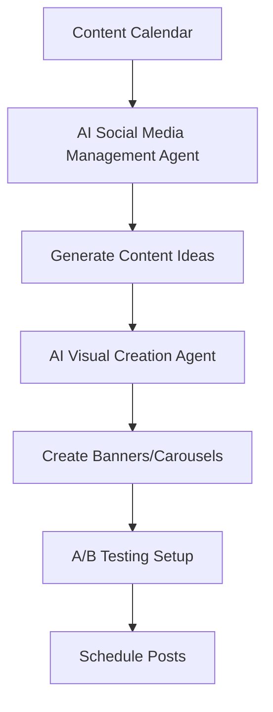
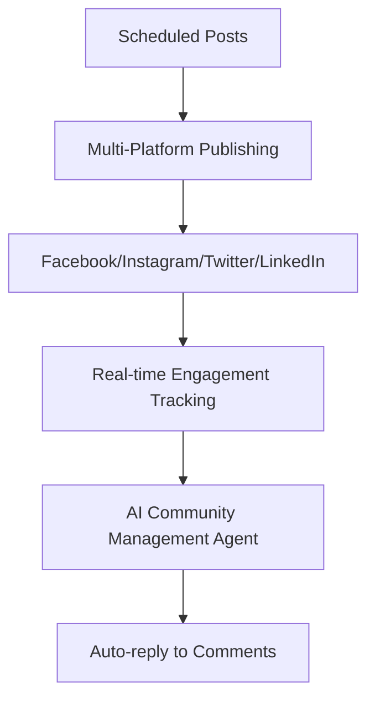
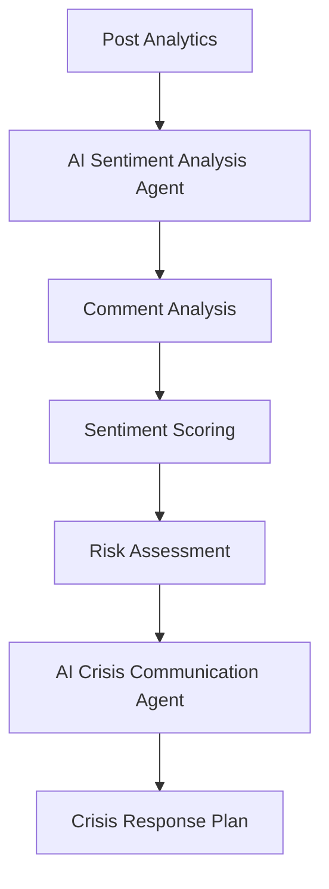
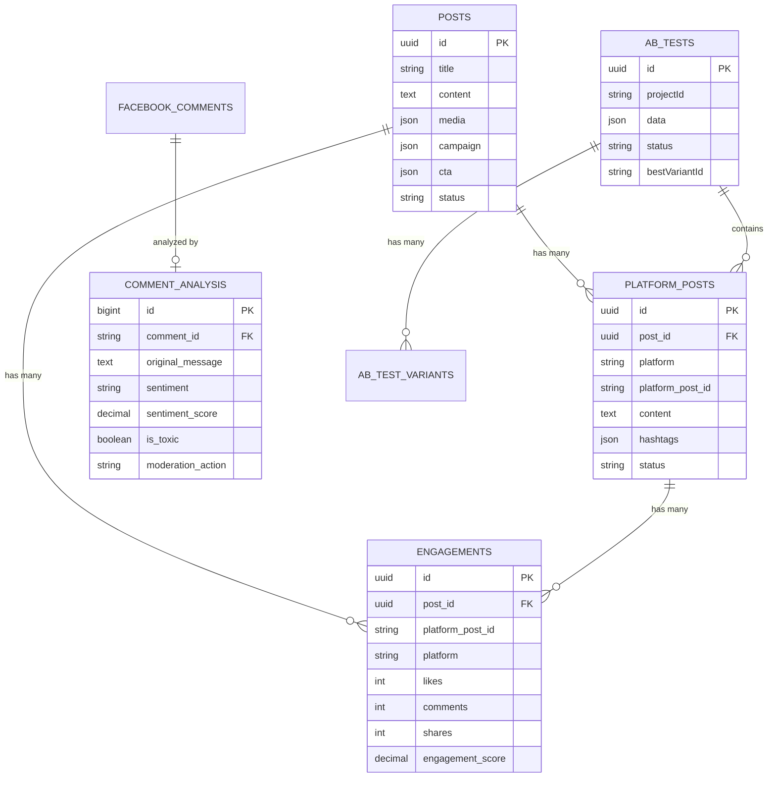
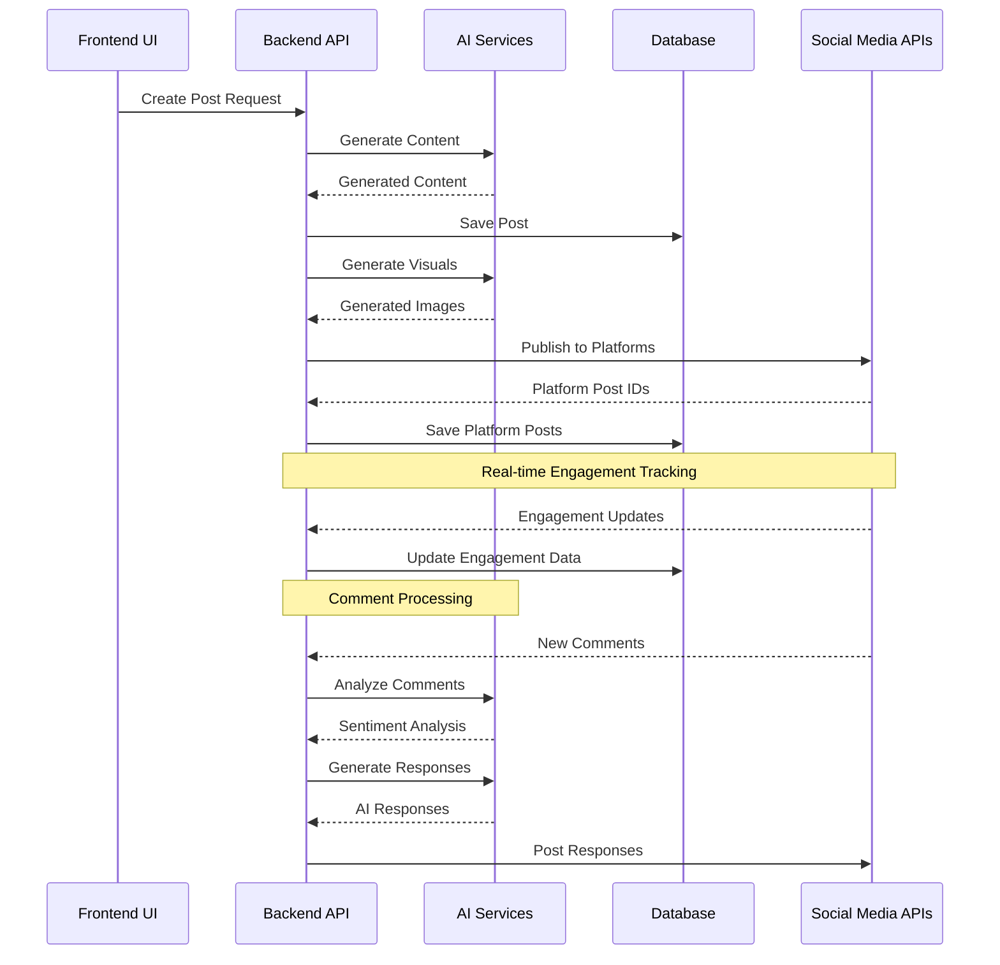

# Communication & PR - AI Social Media Management System

## Overview

Hệ thống quản lý truyền thông và PR tự động với 5 AI Agents chính, được thiết kế để tự động hóa toàn bộ quy trình quản lý mạng xã hội, từ tạo nội dung đến phân tích cảm xúc và xử lý khủng hoảng.

## 5 AI Agents Chính

### 1. 🤖 AI Social Media Management Agent
**Chức năng:** Tự động hóa đăng bài, phân tích tương tác và chiến dịch

### 2. 🎨 AI Visual Creation Agent  
**Chức năng:** Tự động tạo banner, carousel và A/B testing visuals

### 3. 👥 AI Community Management Agent
**Chức năng:** Tự động trả lời bình luận và phân tích cảm xúc

### 4. 📊 AI Sentiment Analysis Agent
**Chức năng:** Tự động gắn thẻ đánh giá, cảnh báo rủi ro và ngăn chặn khủng hoảng

### 5. 🚨 AI Crisis Communication Agent
**Chức năng:** Tự động mẫu tin nhắn khẩn cấp và lập kế hoạch tình huống

---

## 📋 Kịch Bản Hoạt Động Tổng Thể

### Phase 1: Content Planning & Creation


### Phase 2: Publishing & Engagement


### Phase 3: Analysis & Monitoring


---

## 🗂️ Cấu Trúc Bài Đăng và Thuộc Tính

### 1. Post Entity (Posts Table)
```javascript
{
  id: "UUID",
  title: "Tiêu đề bài viết",
  content: "Nội dung chính",
  topic: "Chủ đề (du lịch, ẩm thực, giải trí...)",
  status: "draft|scheduled|pending|published|failed",
  useAI: true, // Có sử dụng AI tạo nội dung
  quality_score: 85, // Điểm chất lượng (0-100)
  media: {
    images: ["url1", "url2"],
    videos: ["url1"],
    thumbnails: ["url1"]
  },
  campaign: {
    name: "Summer Campaign 2024",
    budget: 10000,
    target_audience: "18-35, urban, travel lovers",
    goals: ["awareness", "engagement", "conversion"]
  },
  platform: ["facebook", "instagram"], // Đa nền tảng
  cta: {
    type: "link|button|form",
    text: "Đặt tour ngay",
    url: "https://booking.example.com",
    tracking_id: "cta_001"
  },
  platform_post_id: "fb_123456789", // ID từ platform
  published_at: "2024-01-15T10:30:00Z",
  created_at: "2024-01-15T09:00:00Z",
  updated_at: "2024-01-15T10:30:00Z"
}
```

### 2. Platform Post Entity (Platform Posts Table)
```javascript
{
  id: "UUID",
  post_id: "parent_post_uuid",
  platform: "facebook|instagram|twitter|linkedin",
  platform_post_id: "fb_123456789",
  content: "Nội dung tối ưu cho platform cụ thể",
  hashtags: ["#travel", "#vietnam", "#adventure"],
  image_url: "https://cdn.example.com/image.jpg",
  post_type: "photo|video|carousel|story|reel",
  aspect_ratio: "16:9|1:1|4:5|9:16",
  best_time: "morning|afternoon|evening",
  priority: "low|normal|high",
  status: "pending|published|failed|scheduled",
  published_at: "2024-01-15T10:30:00Z",
  error_message: null,
  metadata: {
    platform_specific: {},
    optimization_scores: {
      engagement_potential: 0.85,
      viral_probability: 0.62,
      brand_alignment: 0.92
    }
  }
}
```

### 3. Engagement Entity (Engagements Table)
```javascript
{
  id: "UUID",
  post_id: "parent_post_uuid",
  platform_post_id: "fb_123456789",
  platform: "facebook",
  likes: 1250,
  comments: 89,
  shares: 156,
  views: 15420,
  clicks: 234,
  engagement_score: 8.5, // Tổng điểm tương tác
  reach: 12500, // Số người tiếp cận
  impressions: 18750, // Số lần hiển thị
  engagement_rate: 12.5, // Tỷ lệ tương tác (%)
  last_checked_at: "2024-01-15T11:00:00Z",
  metadata: {
    demographics: {
      age_groups: {"18-24": 35, "25-34": 45, "35-44": 20},
      genders: {"male": 40, "female": 60},
      locations: {"HCM": 50, "HN": 30, "DN": 20}
    },
    peak_engagement_times: ["10:00", "14:00", "20:00"],
    top_comments: ["Amazing!", "Want to visit!", "Beautiful place!"]
  }
}
```

### 4. A/B Test Entity (Ab Tests Table)
```javascript
{
  id: "UUID",
  projectId: "summer_campaign_2024",
  status: "running|completed",
  data: {
    type: "banner|carousel|video",
    brand: "Golden Trip",
    message: "Khám phá Việt Nam cùng chúng tôi!",
    style: "vibrant|minimalist|luxury",
    dimensions: "1200x630",
    target_audience: "travel enthusiasts"
  },
  bestVariantId: "variant_uuid_2",
  scheduledAt: "2024-01-15T10:00:00Z",
  completedAt: "2024-01-16T10:00:00Z",
  platformPostIds: ["fb_123", "fb_124", "fb_125"],
  checked: true,
  notifyEmail: "marketing@example.com",
  type: "banner",
  slides: [
    {
      brand: "Golden Trip",
      message: "Đà Nẵng - Thành phố đáng sống",
      style: "vibrant",
      dimensions: "1200x630"
    },
    {
      brand: "Golden Trip", 
      message: "Hội An - Phố cổ quyến rũ",
      style: "vibrant",
      dimensions: "1200x630"
    }
  ]
}
```

### 5. Comment Analysis Entity (Comment Analysis Table)
```javascript
{
  id: 12345,
  comment_id: "fb_comment_789",
  original_message: "Chỗ này đẹp quá! Muốn đi lắm 💕",
  cleaned_message: "cho nay dep qua muon di lam",
  is_spam: false,
  is_duplicate: false,
  duplicate_of: null,
  message_length: 25,
  word_count: 7,
  has_emoji: true,
  has_link: false,
  has_tag: false,
  language: "vi",
  sentiment: "positive",
  sentiment_score: 0.85,
  confidence_score: 0.92,
  keywords: ["dep", "muon", "di"],
  analyzed_at: "2024-01-15T10:35:00Z",
  is_toxic: false,
  toxic_category: null,
  toxic_score: 0.00,
  moderation_action: "none",
  moderated_at: null
}
```

---

## 🔄 Workflow Tích Hợp Các Agents

### 1. AI Social Media Management Agent Workflow

```javascript
// Input: Content Calendar, Trends, Audience Insights
const socialMediaWorkflow = {
  // Phase 1: Content Planning
  contentPlanning: {
    input: {
      calendar: "content_calendar_2024",
      trends: "trending_topics_vietnam",
      audience: "travel_enthusiasts_18_35"
    },
    process: [
      "analyzeTrendingTopics()",
      "generateContentIdeas()", 
      "optimizeForPlatforms()",
      "scheduleOptimalTimes()"
    ],
    output: {
      posts: "scheduled_posts_array",
      campaigns: "campaign_objects",
      metrics: "performance_predictions"
    }
  },
  
  // Phase 2: Publishing
  publishing: {
    input: {
      posts: "scheduled_posts",
      platforms: ["facebook", "instagram", "twitter"],
      automation: true
    },
    process: [
      "validateContent()",
      "optimizeForPlatform()",
      "publishToPlatforms()",
      "trackInitialEngagement()"
    ],
    output: {
      published_posts: "platform_post_ids",
      status: "publishing_results",
      errors: "error_logs"
    }
  },
  
  // Phase 3: Engagement Analysis
  engagementAnalysis: {
    input: {
      posts: "published_posts",
      timeframe: "24_hours",
      metrics: ["likes", "comments", "shares", "clicks"]
    },
    process: [
      "fetchEngagementData()",
      "calculateEngagementScore()",
      "identifyTopPerformers()",
      "generateInsights()"
    ],
    output: {
      engagement_metrics: "detailed_analytics",
      insights: "performance_insights",
      recommendations: "optimization_suggestions"
    }
  }
};
```

### 2. AI Visual Creation Agent Workflow

```javascript
const visualCreationWorkflow = {
  // Banner Creation
  bannerCreation: {
    input: {
      type: "banner",
      brand: "Golden Trip",
      message: "Khám phá Nha Trang tuyệt đẹp",
      style: "vibrant",
      dimensions: "1200x630"
    },
    process: [
      "generateVisualPrompt()",
      "createBaseDesign()",
      "applyBrandElements()",
      "optimizeForPlatforms()"
    ],
    output: {
      images: ["banner_v1.jpg", "banner_v2.jpg"],
      variants: "ab_test_variants",
      metadata: "design_metadata"
    }
  },
  
  // Carousel Creation
  carouselCreation: {
    input: {
      type: "carousel",
      slides: [
        {destination: "Nha Trang", message: "Bãi biển tuyệt đẹp"},
        {destination: "Đà Nẵng", message: "Cầu vàng nổi tiếng"},
        {destination: "Hội An", message: "Phố cổ quyến rũ"}
      ],
      style: "consistent",
      dimensions: "1080x1080"
    },
    process: [
      "createSlideDesigns()",
      "ensureVisualConsistency()",
      "addNavigationElements()",
      "generateMultipleVariants()"
    ],
    output: {
      carousel_sets: ["carousel_v1", "carousel_v2"],
      individual_slides: "slide_assets",
      ab_test_data: "variant_configurations"
    }
  },
  
  // A/B Testing Setup
  abTestingSetup: {
    input: {
      variants: "visual_variants",
      test_duration: "24_hours",
      success_metric: "engagement_rate",
      target_audience: "travel_lovers"
    },
    process: [
      "randomizeVariantDistribution()",
      "setupTracking()",
      "monitorPerformance()",
      "analyzeResults()"
    ],
    output: {
      test_results: "ab_test_analytics",
      winning_variant: "best_performing_design",
      recommendations: "future_design_insights"
    }
  }
};
```

### 3. AI Community Management Agent Workflow

```javascript
const communityManagementWorkflow = {
  // Comment Processing
  commentProcessing: {
    input: {
      comments: "new_facebook_comments",
      post_context: "post_content_and_metadata",
      brand_voice: "friendly_professional"
    },
    process: [
      "analyzeCommentSentiment()",
      "detectSpamAndToxic()",
      "generateAppropriateResponse()",
      "applyBrandVoice()"
    ],
    output: {
      responses: "ai_generated_replies",
      moderation_actions: "hide_delete_flags",
      sentiment_scores: "comment_analysis_data"
    }
  },
  
  // Engagement Optimization
  engagementOptimization: {
    input: {
      post_performance: "current_engagement_data",
      comment_volume: "comment_count_and_rate",
      response_time: "average_response_time"
    },
    process: [
      "identifyEngagementOpportunities()",
      "prioritizeHighValueComments()",
      "optimizeResponseTiming()",
      "trackCommunityGrowth()"
    ],
    output: {
      engagement_plan: "response_strategy",
      priority_comments: "high_value_interactions",
      growth_metrics: "community_analytics"
    }
  }
};
```

### 4. AI Sentiment Analysis Agent Workflow

```javascript
const sentimentAnalysisWorkflow = {
  // Real-time Sentiment Monitoring
  sentimentMonitoring: {
    input: {
      comments: "streaming_comment_data",
      posts: "published_post_analytics",
      mentions: "brand_mentions"
    },
    process: [
      "analyzeSentimentInRealTime()",
      "identifySentimentTrends()",
      "detectSentimentShifts()",
      "generateSentimentReports()"
    ],
    output: {
      sentiment_dashboard: "real_time_sentiment_data",
      trend_alerts: "sentiment_change_notifications",
      insights: "sentiment_analysis_insights"
    }
  },
  
  // Risk Assessment
  riskAssessment: {
    input: {
      sentiment_data: "historical_and_current_sentiment",
      comment_volume: "engagement_spikes",
      negative_keywords: "risk_indicators"
    },
    process: [
      "calculateRiskScore()",
      "identifyRiskFactors()",
      "predictCrisisProbability()",
      "generateRiskAlerts()"
    ],
    output: {
      risk_score: "overall_risk_assessment",
      risk_factors: "identified_threats",
      crisis_probability: "crisis_likelihood_score"
    }
  },
  
  // Crisis Prevention
  crisisPrevention: {
    input: {
      risk_alerts: "high_risk_indicators",
      sentiment_trends: "negative_trending_topics",
      brand_mentions: "negative_brand_mentions"
    },
    process: [
      "analyzeCrisisTriggers()",
      "developPreventionStrategies()",
      "prepareResponseTemplates()",
      "monitorCrisisEvolution()"
    ],
    output: {
      prevention_plan: "crisis_prevention_strategy",
      response_templates: "prepared_responses",
      monitoring_setup: "enhanced_monitoring_config"
    }
  }
};
```

### 5. AI Crisis Communication Agent Workflow

```javascript
const crisisCommunicationWorkflow = {
  // Crisis Detection
  crisisDetection: {
    input: {
      sentiment_alerts: "negative_sentiment_spikes",
      engagement_anomalies: "unusual_engagement_patterns",
      external_mentions: "news_and_social_mentions"
    },
    process: [
      "analyzeCrisisIndicators()",
      "assessCrisisSeverity()",
      "identifyCrisisType()",
      "activateCrisisMode()"
    ],
    output: {
      crisis_level: "low_medium_high_critical",
      crisis_type: "brand_reputation_customer_service",
      affected_areas: "platforms_and_channels"
    }
  },
  
  // Response Planning
  responsePlanning: {
    input: {
      crisis_data: "crisis_analysis_results",
      brand_guidelines: "crisis_communication_guidelines",
      stakeholder_list: "internal_and_external_stakeholders"
    },
    process: [
      "developResponseStrategy()",
      "createMessageTemplates()",
      "planStakeholderCommunication()",
      "prepareEscalationProcedures()"
    ],
    output: {
      response_strategy: "crisis_communication_plan",
      message_templates: "approved_response_messages",
      stakeholder_plan: "communication_timeline"
    }
  },
  
  // Crisis Execution
  crisisExecution: {
    input: {
      response_plan: "approved_crisis_strategy",
      message_templates: "crisis_response_templates",
      monitoring_data: "real_time_crisis_metrics"
    },
    process: [
      "deployCrisisMessages()",
      "monitorResponseEffectiveness()",
      "adjustStrategyInRealTime()",
      "trackCrisisResolution()"
    ],
    output: {
      deployed_responses: "sent_messages_and_updates",
      effectiveness_metrics: "response_performance_data",
      resolution_status: "crisis_resolution_tracking"
    }
  }
};
```

---

## 🔗 Liên Kết Giữa Các Components

### Database Relationships


### API Integration Flow


### Service Dependencies
```javascript
// Service Architecture
const serviceDependencies = {
  // Core Services
  PostsService: {
    depends_on: ["Database", "AI_Content_Generation"],
    provides: ["Post_Management", "Content_Scheduling"]
  },
  
  VisualService: {
    depends_on: ["AI_Image_Generation", "A/B_Testing_Engine"],
    provides: ["Visual_Creation", "A/B_Testing"]
  },
  
  CommentService: {
    depends_on: ["SentimentAnalysis", "ToxicDetection", "AI_Response_Generation"],
    provides: ["Comment_Processing", "Auto_Response"]
  },
  
  SentimentAnalysisService: {
    depends_on: ["TextProcessing", "ToxicDetection", "KeywordAnalysis"],
    provides: ["Sentiment_Analysis", "Risk_Assessment"]
  },
  
  EngagementService: {
    depends_on: ["SocialMediaAPIs", "AnalyticsEngine"],
    provides: ["Engagement_Tracking", "Performance_Analytics"]
  },
  
  // AI Services
  AIPromptService: {
    depends_on: ["TemplateEngine", "GeminiAPI"],
    provides: ["AI_Content_Generation", "Response_Templates"]
  },
  
  // External Integrations
  SocialService: {
    depends_on: ["FacebookAPI", "InstagramAPI", "TwitterAPI", "LinkedInAPI"],
    provides: ["Multi_Platform_Publishing", "Analytics_Collection"]
  }
};
```

---

## 📊 Metrics và KPIs

### Performance Metrics
```javascript
const systemMetrics = {
  // Content Performance
  contentMetrics: {
    post_engagement_rate: "12.5%", // Average across platforms
    viral_coefficient: "1.8", // Shares per view
    content_quality_score: "85/100", // AI-generated quality score
    optimal_posting_time: "14:00-16:00", // Best performing time slots
  },
  
  // Visual Performance
  visualMetrics: {
    ab_test_success_rate: "78%", // A/B tests that improved performance
    visual_engagement_boost: "+25%", // Improvement from optimized visuals
    brand_consistency_score: "92/100", // Visual brand alignment
    creative_variation_rate: "15", // Number of visual variants tested
  },
  
  // Community Management
  communityMetrics: {
    response_time: "2.5 minutes", // Average AI response time
    response_accuracy: "89%", // Appropriate responses vs total
    community_growth_rate: "+15%/month", // Follower growth
    engagement_quality_score: "8.2/10", // Quality of interactions
  },
  
  // Sentiment Analysis
  sentimentMetrics: {
    sentiment_accuracy: "91%", // Correct sentiment classification
    risk_detection_rate: "95%", // Crisis situations detected
    crisis_prevention_rate: "88%", // Crises prevented vs total risks
    brand_sentiment_trend: "+0.3", // Sentiment score improvement
  },
  
  // Crisis Management
  crisisMetrics: {
    crisis_detection_time: "5 minutes", // Time to detect crisis
    response_deployment_time: "15 minutes", // Time to deploy response
    crisis_resolution_rate: "94%", // Successfully resolved crises
    reputation_recovery_time: "48 hours", // Time to recover reputation
  }
};
```

---

## 🚀 Implementation Roadmap

### Phase 1: Foundation (Weeks 1-2)
- [ ] Database schema setup with all entities
- [ ] Basic AI services integration
- [ ] Core posting functionality
- [ ] Simple engagement tracking

### Phase 2: AI Integration (Weeks 3-4)
- [ ] AI content generation
- [ ] Visual creation automation
- [ ] A/B testing implementation
- [ ] Comment sentiment analysis

### Phase 3: Advanced Features (Weeks 5-6)
- [ ] Multi-platform optimization
- [ ] Advanced sentiment analysis
- [ ] Crisis detection system
- [ ] Automated response templates

### Phase 4: Intelligence & Optimization (Weeks 7-8)
- [ ] Predictive analytics
- [ ] Machine learning optimization
- [ ] Advanced A/B testing
- [ ] Performance optimization

### Phase 5: Enterprise Features (Weeks 9-10)
- [ ] Multi-brand management
- [ ] Advanced reporting
- [ ] API integrations
- [ ] White-label capabilities

---

## 💡 Use Cases Thực Tế

### Use Case 1: Tourism Campaign Launch
```javascript
const tourismCampaign = {
  scenario: "Launch summer tourism campaign for Golden Trip",
  
  // AI Social Media Management Agent
  content_planning: {
    topics: ["beach destinations", "summer activities", "travel tips"],
    platforms: ["facebook", "instagram", "tiktok"],
    schedule: "daily posts for 30 days",
    target_audience: "travel enthusiasts 18-35"
  },
  
  // AI Visual Creation Agent
  visual_creation: {
    banners: [
      {theme: "Nha Trang beaches", style: "vibrant"},
      {theme: "Da Nang attractions", style: "luxury"},
      {theme: "Hoi An old town", style: "heritage"}
    ],
    carousels: [
      {destinations: ["Nha Trang", "Da Nang", "Hoi An"], format: "travel_guide"},
      {activities: ["diving", "sightseeing", "food_tour"], format: "activity_showcase"}
    ],
    ab_tests: [
      {test: "banner_colors", variants: ["blue_ocean", "golden_sunset"]},
      {test: "carousel_layout", variants: ["horizontal", "vertical"]}
    ]
  },
  
  // Expected Results
  expected_outcomes: {
    engagement_rate: "+40%",
    reach: "500K+ people",
    conversions: "2.5% booking rate",
    brand_sentiment: "+0.5 improvement"
  }
};
```

### Use Case 2: Crisis Management Scenario
```javascript
const crisisScenario = {
  scenario: "Negative review goes viral on social media",
  
  // Crisis Detection
  detection: {
    trigger: "Negative sentiment spike detected",
    severity: "Medium risk",
    affected_platforms: ["facebook", "instagram"],
    initial_metrics: {
      negative_mentions: "+300%",
      sentiment_score: "-0.7",
      engagement_spike: "+150%"
    }
  },
  
  // AI Crisis Communication Agent Response
  response: {
    immediate_actions: [
      "Deploy prepared response templates",
      "Monitor sentiment in real-time",
      "Prepare escalation if needed"
    ],
    messaging: {
      tone: "Empathetic and professional",
      key_points: ["Acknowledge concern", "Provide solution", "Show commitment"],
      channels: ["direct_replies", "public_statements", "email_communication"]
    },
    timeline: {
      detection: "5 minutes",
      response_deployment: "15 minutes",
      monitoring_period: "24 hours",
      resolution_target: "48 hours"
    }
  },
  
  // Recovery Metrics
  recovery_metrics: {
    sentiment_recovery: "48 hours",
    reputation_score: "85% of pre-crisis level",
    customer_retention: "92%",
    lessons_learned: "Updated crisis response templates"
  }
};
```

Hệ thống này tạo ra một môi trường quản lý truyền thông hoàn toàn tự động, thông minh và có khả năng phản ứng nhanh với các tình huống thực tế trong ngành du lịch và dịch vụ.
